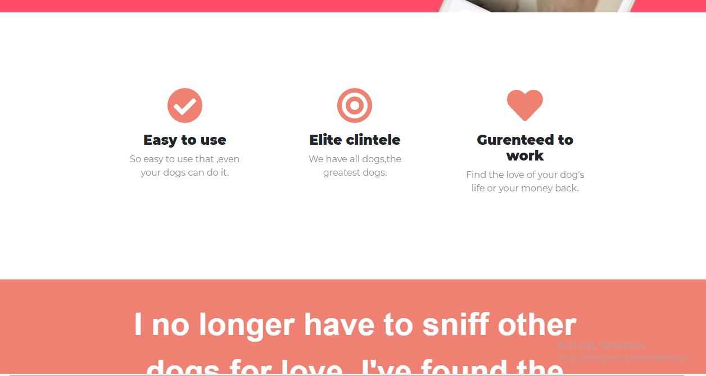
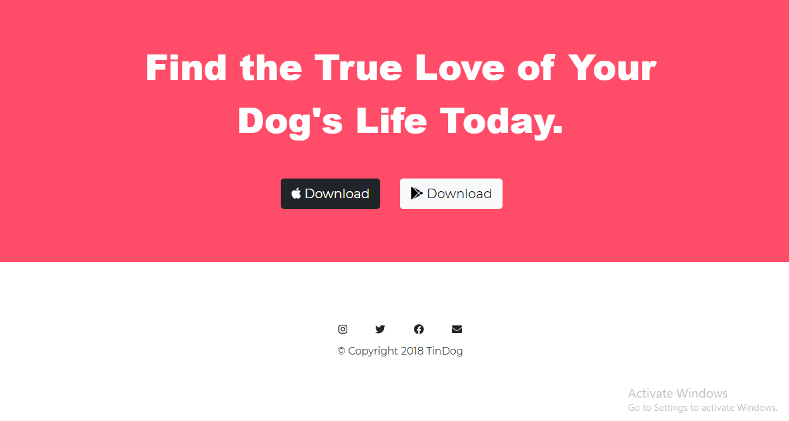

# Tindog
Tindog is a website design based on an idea of dog dating site.
This site idea and design is inspired from fullstack webdev course of Angelena Yu.
The module focused more on bootstrap and advanced CSS concepts 
<h3>Concepts that i have learnt  </h3>
<ul>
  <li>Wireframe</li>
  <li>Toggler - Dropdown Menu,navbar,what is responsive site? </li>
   <li>Grid Layout System</li>
 <li>Containers</li>
 <li>Carousel-bootstrap</li>
 <li>Cards</li>
 <li>Z-Index</li>
 <li>Media Query Breakpoints</li>
 <li>Code Refactoring(Clean code)</li>
 <li>Combining Selectors(Non-hierarchical,Hierarchical Selectors,Multiple Selectors)</li>
 <li>Selector Priority</li>
</ul>
<h3>Preview of the site</h3>

